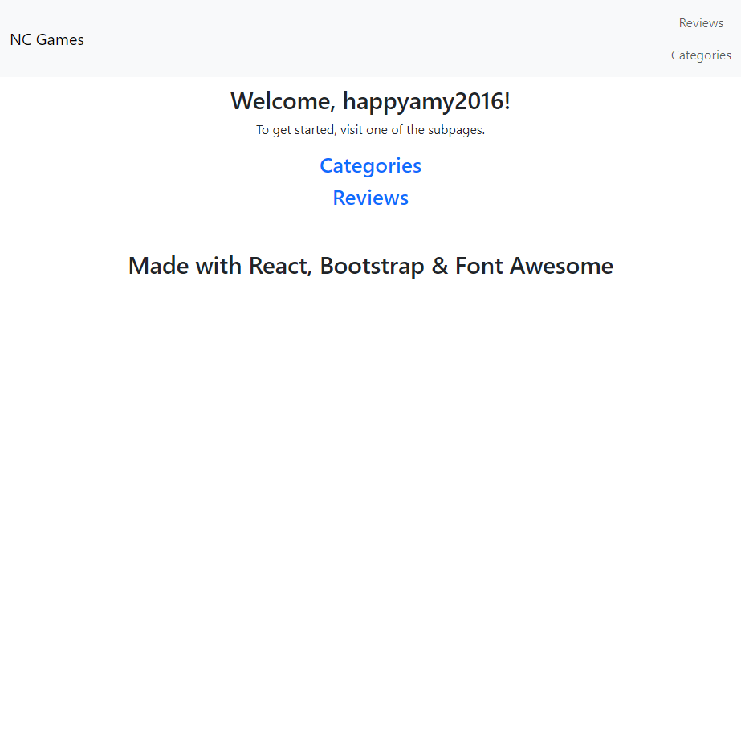

# NC Games Front-end



This is my Northcoders front-end project. It's a simple review site where you can view reviews of board games.

[This site is hosted here.](https://master--incredible-meerkat-f15c3c.netlify.app)

[Back-end can be found here.](https://github.com/iy2k22/be-nc-games)

## Dependencies
* Node (>= 20.8)

## Running Locally
To run the project locally, you'll first need to clone the repo and cd into it.
```sh
git clone https://github.com/iy2k22/nc-games-fe.git
cd nc-games-fe
```

Then, you'll need to install the required node packages.
```sh
npm i
```

Finally, you can run the project with:
```sh
npm start
```

## Credits
* [Bootstrap](https://getbootstrap.com)
* [Font Awesome](https://fontawesome.com)
* [React](https://react.dev)